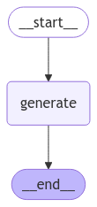

# ChatGPT Clone using LLaMA-3.1-70B-Versatile from GROQ, LangGraph, and Streamlit

## Description
This repository contains a clone of ChatGPT, a conversational AI chatbot, built using the LLaMA-3.1-70B-Versatile model from GROQ, LangGraph, and Streamlit.

## GROQ https://groq.com/
The AI landscape is undergoing a significant shift towards deploying and running models, also known as inference. Groq empowers developers and enterprises to harness this power, providing **fast AI inference in the cloud**.
The **Groq Language Processing Unit (LPU)** is the game-changing technology designed for AI inference and language.

## LangGraph

## Features
* **LLaMA-3.1-70B-Versatile Model**: The chatbot is powered by the LLaMA-3.1-70B-Versatile model, a state-of-the-art language model that enables human-like conversations.
* **LangGraph**: LangGraph is used to generate text and provide a more human-like conversation experience.
* **Streamlit Interface**: The chatbot is built using Streamlit, a popular Python library for building web applications, providing a user-friendly interface for interacting with the chatbot.
* **Conversational AI**: The chatbot is designed to engage in natural-sounding conversations, using context and understanding to respond to user input.

## How to use:
-   Clone this repository `git clone <repository-url>`
-   Initialize poetry with `poetry init -n`
-   Run `poetry config virtualenvs.in-project true` so that virtualenv will be present in project directory
-   Run `poetry env use <C:\Users\username\AppData\Local\Programs\Python\Python310\python.exe>` to create virtualenv in project (change username to your username)
-   Run `poetry shell`
-   Run `poetry install` to install requried packages
-   Create `.env` file and insert all keys: `GROQ_API_KEY`
-   Run `streamlit run main.py`
